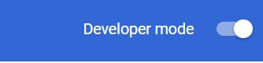
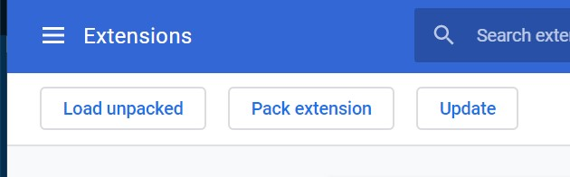
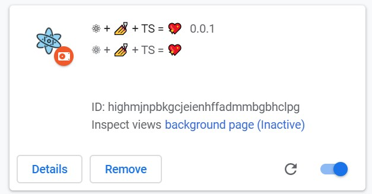

# typescript-styled-components-react-chrome-extension-template

Template for extensions, built with React, TypeScript & Styled Components.
Also using EsLint, Jest & Prettier

## How 2 run

1. Install dependencies

   `yarn`

2. Start webpack

   `yarn dev`

3. Open up [chrome://extensions](chrome://extensions) in your browser.

4. Make sure the `Developer Mode` checkbox in the upper-right corner is turned on.

   

5. Click `Load unpacked`

   

6. Select the `dist` directory in this repository

7. your extension is ready to go!

   

## Scripts

- `yarn dev` - run `webpack` in `watch` mode
- `yarn storybook` - runs the Storybook server
- `yarn build` - builds the production-ready unpacked extension
- `yarn test -u` - runs Jest + updates test snapshots
- `yarn lint` - runs EsLint
- `yarn lint:css` - Run stylelint on all styled components
- `yarn prettify` - runs Prettier

### Technologies

- [React](https://reactjs.org)
- [TypeScript](https://www.typescriptlang.org/)
- [Storybook](https://storybook.js.org/)
- [Jest](https://jestjs.io)
- [Eslint](https://eslint.org/)
- [Webpack](https://webpack.js.org/)
- [Babel](https://babeljs.io/)
- [StyledComponents](https://styled-components.com)

### More Info

- [Chrome Extension Developer Guide](https://developer.chrome.com/extensions/devguide)
